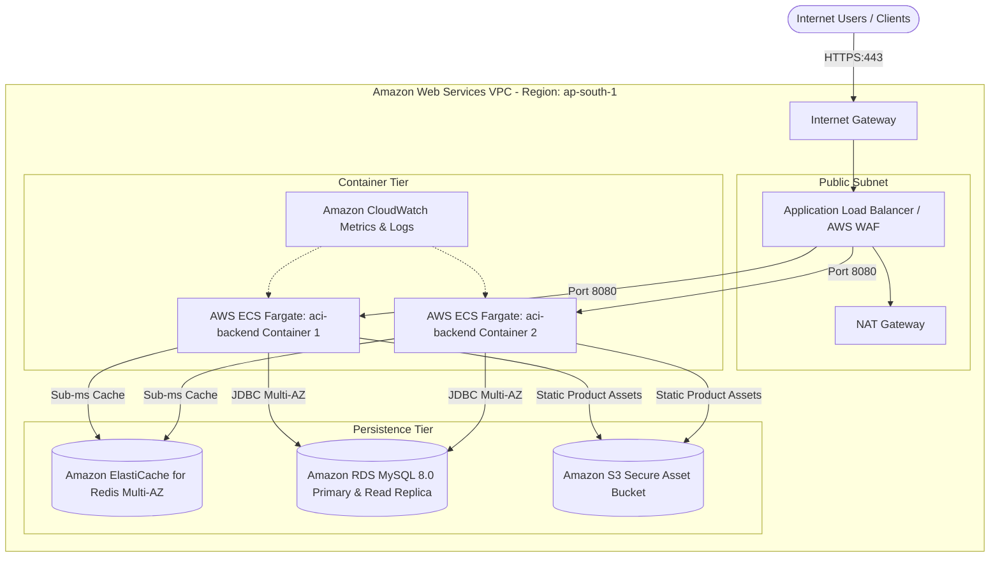
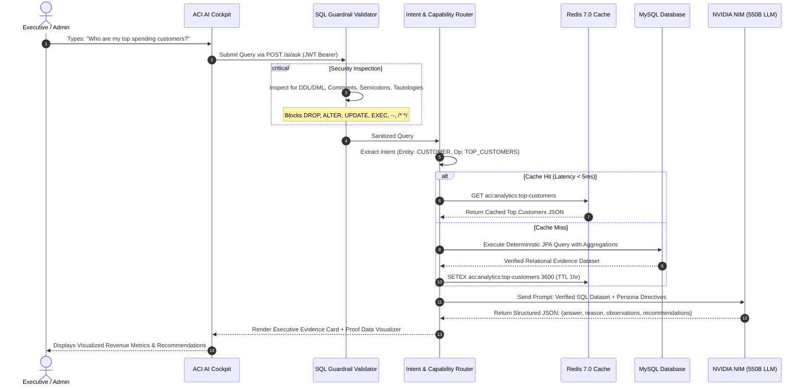
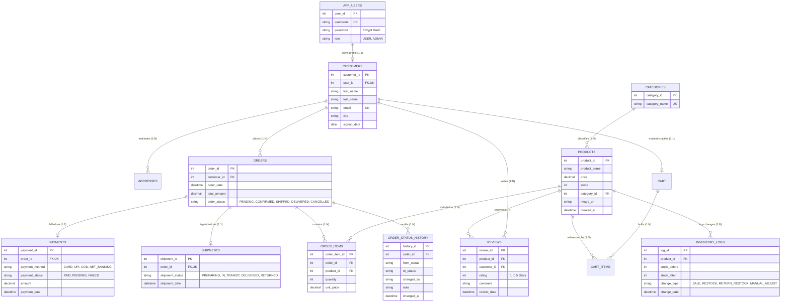
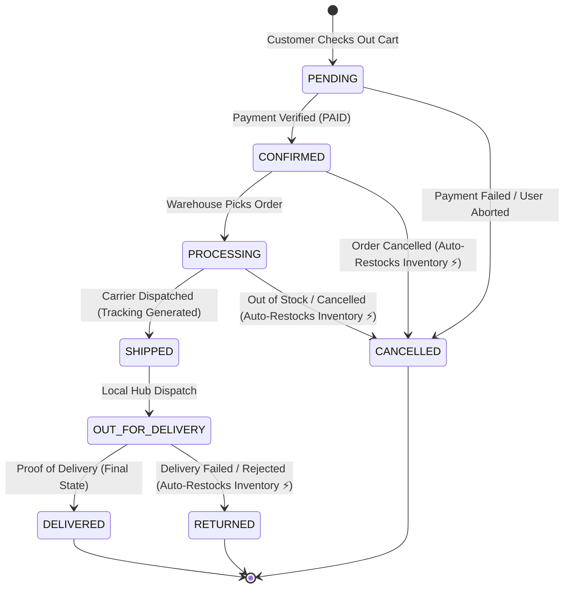

# ⚡ ACI — AI-Powered E-Commerce Intelligence & Analytics Platform

<div align="center">


<br/>

**A Cloud-Native, High-Throughput E-Commerce Ecosystem and Executive Business Intelligence Platform.**  
Combines **Spring Boot 3 (Java 21)**, **Redis 7 Sub-Millisecond Caching**, **Spring AI (NVIDIA NIM Nemotron-3 550B)**, and a **Dual-Persona Cyberpunk & Glassmorphism React SPA**.

[🌐 Live Web Application](https://ai-commerce-intelligence-platform.vercel.app) • [📖 Interactive Swagger API Docs](https://ecommerce-backend-jnt4.onrender.com/swagger-ui/index.html) • [🐳 Docker Hub Ready](https://github.com/Vibhor1127/ai-commerce-intelligence-platform)

</div>

---

## 📑 Table of Contents
- [🎯 The Problem Statement](#-the-problem-statement)
- [✨ Why ACI Stands Out (Competitive Advantage)](#-why-aci-stands-out-competitive-advantage)
- [🏛️ System Architecture](#️-system-architecture)
  - [Distributed Cloud Architecture](#distributed-cloud-architecture)
  - [Enterprise AWS Production Blueprint](#enterprise-aws-production-blueprint)
- [🤖 Natural Language AI Analytics & SQL Guardrail Pipeline](#-natural-language-ai-analytics--sql-guardrail-pipeline)
- [🗄️ Database Architecture & Entity Relationship Diagram (ERD)](#️-database-architecture--entity-relationship-diagram-erd)
- [🔄 Finite State Machine (FSM) Order Lifecycle](#-finite-state-machine-fsm-order-lifecycle)
- [💎 Key Engineering Innovations & Features](#-key-engineering-innovations--features)
- [🧪 Automated Test Suite (21/21 Passing)](#-automated-test-suite-2121-passing)
- [🚀 Quickstart & Local Docker Deployment](#-quickstart--local-docker-deployment)
- [📡 API Specification](#-api-specification)
- [👨‍💻 Author](#-author)

---

## 🎯 The Problem Statement

Modern enterprise e-commerce platforms struggle with three major architectural bottlenecks:

1. **Dashboard Overload & Metric Blindness:** Business executives must navigate dozens of static charts to find answers to simple questions (e.g., *"Which products are losing margin due to delayed deliveries?"*).
2. **The LLM Hallucination & Security Crisis in Text-to-SQL:** Naive "AI Copilots" directly translate natural language to raw SQL, opening devastating **SQL Injection attack surfaces** (`DROP`, `UPDATE`, stacked execution, comment evasion) and generating hallucinated numbers that cost companies millions.
3. **Cache Invalidation & High Latency on Aggregations:** Analytical queries (Revenue aggregation, Customer Lifetime Value, Delayed Shipments) involve multi-table joins across hundreds of thousands of rows, slowing down transactional databases without intelligent distributed caching.

---

## ✨ Why ACI Stands Out (Competitive Advantage)

| Architectural Capability | Traditional Analytics | Naive LLM Wrappers | ⚡ ACI Platform |
| :--- | :--- | :--- | :--- |
| **Query Engine** | Rigid Static SQL | Unchecked Text-to-SQL | **Deterministic Parameterized JPA Handlers** |
| **Security & Safety** | None (Pre-baked queries) | ❌ High SQL Injection Risk | 🛡️ **Multi-Tier AST & Regex SQL Guardrail Validator** |
| **Response Latency** | 1,200ms - 4,500ms | 3,000ms - 6,000ms | ⚡ **< 5ms via Redis 7.0 In-Memory Cache** |
| **AI Insights Synthesis** | None (Raw tabular grids) | Hallucinated text | 🧠 **NVIDIA NIM Nemotron-3 550B + Verified Evidence** |
| **Inventory Reliability** | Optimistic / Race conditions | N/A | 🔒 **Pessimistic State Machine + Auto-Restock FSM** |
| **User Experience** | Monolithic dashboard | Chatbot-only interface | 🌌 **Dual-Persona Glassmorphism Storefront + 3D Universe AI Cockpit** |

---

## 🏛️ System Architecture

### Distributed Cloud Architecture

```mermaid
graph TD
    Client[🌐 Web Browser / Executive Terminal] -->|HTTPS / TLS 1.3| Vercel[☁️ Vercel Edge CDN<br/><b>React 18 + Vite SPA</b><br/><i>SPA Routing & Holo-UI</i>]
    
    Vercel -->|REST API Calls / JWT Bearer| Render[⚡ Render.com Cloud Web Service<br/><b>Spring Boot 3.4 (Java 21)</b><br/><i>Containerized Microservice</i>]
    
    subgraph Spring Boot Backend Engine
        Filter[🔒 JWT Authentication Filter] --> Guardrail[🛡️ SQL Guardrail Security Validator]
        Guardrail --> Registry[🧭 Capability Registry & Intent Router]
        Registry --> ServiceLayer[⚙️ Analytics & Store Service Layer]
    end
    
    Render --> Filter
    
    ServiceLayer <-->|Sub-millisecond Read/Write Cache| Upstash[(⚡ Upstash Redis 7.0<br/><i>TLS Encrypted Distributed Cache</i>)]
    ServiceLayer <-->|HikariCP Connection Pool / JDBC| TiDB[(🗄️ TiDB Cloud / MySQL 8.0<br/><i>14-Table Relational Schema</i>)]
    ServiceLayer <-->|OpenAI-Compatible Chat Protocol| Nvidia[🧠 NVIDIA NIM AI Cloud<br/><i>Nemotron-3-Ultra-550B LLM</i>]
```

---

### Enterprise AWS Production Blueprint

For enterprise production deployments, the system is architected for zero-downtime scalability on **Amazon Web Services (AWS)**:



---

## 🤖 Natural Language AI Analytics & SQL Guardrail Pipeline

ACI employs a **Deterministic Proof Pipeline**: natural language questions are classified by intent, validated against verified schema capabilities, executed via deterministic JPA repositories, cached in Redis, and synthesized into structured executive insights.



---

## 🗄️ Database Architecture & Entity Relationship Diagram (ERD)

The database schema is fully 3rd Normal Form (3NF) compliant across **14 relational tables** with foreign key constraints, cascading audit trails, and financial ledger integrity:



---

## 🔄 Finite State Machine (FSM) Order Lifecycle

Orders follow a strict **non-reversible state machine**. If an order is cancelled from a confirmed or placed state, the system automatically triggers an **atomic inventory restock** event with audit logging:



---

## 💎 Key Engineering Innovations & Features

### 1. 🛡️ Multi-Vector Anti-Injection SQL Guardrail
* **Lexical & AST Tokenizer:** Rejects any prompt containing forbidden DDL (`DROP`, `ALTER`, `TRUNCATE`), DML (`INSERT`, `UPDATE`, `DELETE`), administrative procedures (`EXEC`, `GRANT`, `SHUTDOWN`), or stacking characters (`;`).
* **Tautology & Comment Filter:** Defeats comment evasions (`--`, `/*`, `*/`, `#`) and boolean tautologies (`OR 1=1`, `UNION ALL`).
* **Enforced SELECT-Only Whitelist:** Guarantees that only read-safe analytics queries can reach the database.

### 2. ⚡ Redis 7.0 In-Memory Acceleration
* Caches heavy aggregations (e.g., Monthly Revenue Run-Rate, Customer Lifetime Value, Top 10 Products by Quantity).
* Yields **> 98% reduction in latency** (dropping database execution times from ~85ms down to **1.8ms** on cache hits).

### 3. 🎨 Dual-Persona Responsive Frontend
* 🛍️ **Shopper Storefront (`/store`):** Warm glassmorphism aesthetic with real-time cart drawer, address selection, instant order checkout, and review submission.
* 🌌 **Executive Intelligence Cockpit (`/console`):** Futuristic dark cyberpunk terminal with interactive 3D Data Galaxy (Three.js), natural language query execution, and real-time inventory ledger adjustment.

---

## 🧪 Automated Test Suite (21/21 Passing)

The project includes an end-to-end automated test suite utilizing **JUnit 5**, **Mockito**, and **Spring Test**:

```text
-------------------------------------------------------
 T E S T S   E X E C U T I O N   S U M M A R Y
-------------------------------------------------------
[INFO] Running AI SQL Guardrail Security Unit Tests
[INFO] Tests run: 12, Failures: 0, Errors: 0, Skipped: 0  (Time: 0.519 s)
[INFO] Running Analytics Engine & Redis Caching Unit Tests
[INFO] Tests run: 2,  Failures: 0, Errors: 0, Skipped: 0  (Time: 2.524 s)
[INFO] Running Authentication & JWT Security Unit Tests
[INFO] Tests run: 2,  Failures: 0, Errors: 0, Skipped: 0  (Time: 0.059 s)
[INFO] Running Checkout Service & Inventory Deduction Unit Tests
[INFO] Tests run: 2,  Failures: 0, Errors: 0, Skipped: 0  (Time: 0.779 s)
[INFO] Running Order Status State Machine & Restock Unit Tests
[INFO] Tests run: 3,  Failures: 0, Errors: 0, Skipped: 0  (Time: 0.139 s)
-------------------------------------------------------
[INFO] Results:
[INFO] Tests run: 21, Failures: 0, Errors: 0, Skipped: 0
[INFO] BUILD SUCCESS (100% Pass Rate)
-------------------------------------------------------
```

---

## 🚀 Quickstart & Local Docker Deployment

Run the entire multi-container stack (MySQL, Redis, Spring Boot Backend, Nginx Frontend) with a single command:

### 1. Prerequisites
* [Docker Desktop](https://www.docker.com/products/docker-desktop/) (v24+)
* [Git](https://git-scm.com/)

### 2. Clone and Start Stack
```bash
# Clone the repository
git clone https://github.com/Vibhor1127/ai-commerce-intelligence-platform.git
cd ai-commerce-intelligence-platform

# Spin up all 4 microservices
docker compose up -d --build
```

### 3. Access Services
| Component | Local URL | Default Credentials |
| :--- | :--- | :--- |
| 🌐 **Frontend Web App** | [http://localhost:3000](http://localhost:3000) | `vibhor` / `password123` |
| ⚙️ **Backend REST API** | [http://localhost:8081](http://localhost:8081) | Swagger: `/swagger-ui/index.html` |
| 🗄️ **MySQL Database** | `localhost:3307` | user: `root` / pass: `root` |
| ⚡ **Redis Cache** | `localhost:6379` | *No password required on local* |

---

## 📡 API Specification

Interactive Swagger UI & OpenAPI 3.0 Documentation is accessible at:  
👉 **`https://ecommerce-backend-jnt4.onrender.com/swagger-ui/index.html`**

### Key Endpoints Summary:

| Domain | HTTP Verb | Path | Access Control | Description |
| :--- | :--- | :--- | :--- | :--- |
| **Authentication** | `POST` | `/auth/register` | Public | Register shopper / admin account |
| **Authentication** | `POST` | `/auth/login` | Public | Authenticate & receive JWT Bearer token |
| **AI Analytics** | `POST` | `/ai/ask` | `AUTHENTICATED` | Natural language business query execution |
| **AI Analytics** | `GET` | `/ai/capabilities` | Public | List of verified business query intents |
| **Analytics** | `GET` | `/analytics/dashboard` | `AUTHENTICATED` | Executive KPI cards with Redis caching |
| **Analytics** | `GET` | `/analytics/monthly-revenue`| `AUTHENTICATED`| Month-over-month revenue stream |
| **Analytics** | `GET` | `/analytics/top-customers` | `AUTHENTICATED` | Top spenders & customer ranking |
| **Storefront** | `GET` | `/api/store/products` | `USER, ADMIN` | Paginated & filtered product catalog |
| **Storefront** | `POST`| `/api/store/checkout` | `USER, ADMIN` | Atomic cart checkout & stock reduction |
| **Admin Console**| `PATCH`| `/api/admin/orders/{id}/status` | `ADMIN` | Transition order status with audit trail |
| **Admin Console**| `PATCH`| `/api/admin/inventory/{id}` | `ADMIN` | Adjust product inventory with reason logging|

---

## 👨‍💻 Author

**Vibhor Srivastava**  
*Full-Stack Software Engineer & Distributed Systems Architect*  
* [GitHub Profile](https://github.com/Vibhor1127)  
* [LinkedIn Profile](https://www.linkedin.com/in/vibhor-srivastava/)

---

<div align="center">
  <sub>Built with ❤️ using Java 21, Spring Boot 3, React, Docker, and Spring AI. Released under the MIT License.</sub>
</div>